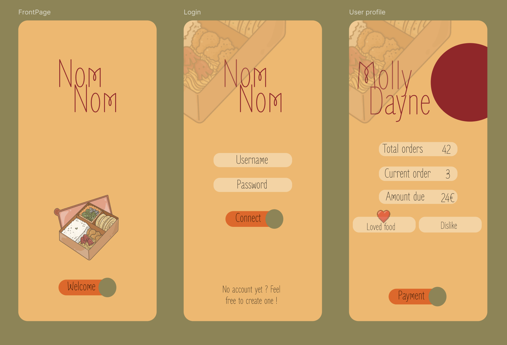

# 🍱 NomNom App

Bienvenue dans **NomNom**, l'application qui révolutionne la gestion des livraisons de repas dans des contenants consignés !  
Pensée avec soin pour les chefs privés et les traiteurs indépendants, NomNom facilite le suivi des commandes, des paiements et des retours de gamelles grâce à une interface intuitive et un système de QR codes intelligent.

👉 [Accéder à l'application](https://www.nom-nom.app/)

---

## 🚀 À propos

NomNom est née d’un besoin bien réel : gérer facilement la vente de gamelles faites maison, sans perdre de vue qui a quoi, combien il reste à payer et ce que chaque client aime ou n’aime pas manger.  
L’application apporte une solution complète, connectée, et désormais **en ligne** 🎉

Grâce à NomNom, tu peux désormais :

- 📦 Gérer les livraisons de repas et suivre le statut de chaque gamelle
- 💰 Suivre les paiements en attente et enregistrer les règlements
- 🔁 Scanner les QR codes des contenants pour les assigner ou les récupérer
- 🧾 Garder une trace de chaque interaction avec tes clients
- 📬 Envoyer un mail de confirmation lors d'une livraison
- 🌐 Travailler depuis n’importe où avec la version hébergée de l'application

---

## 🎯 Fonctionnalités principales

- **QR Code réutilisable** : Chaque boîte possède un QR code qui permet de suivre son cycle de vie (livraison, retour, réutilisation). Fini les contenants perdus !
- **Historique de chaque contenant** : Accède à tout l’historique des livraisons associées à un QR code donné.
- **Impression facile** : Une page dédiée te permet d’imprimer un QR code proprement pour le coller sur tes contenants.
- **Fiche client enrichie** :
  - Nom, prénom, préférences et aversions alimentaires
  - Nombre total de gamelles livrées
  - Solde à régler
  - Gamelles actuellement en sa possession
- **Séparation traiteur / client** : Deux types de comptes avec des interfaces adaptées
- **Interface responsive et accessible** : Compatible avec les besoins des daltoniens et des personnes malvoyantes (contrastes, textes alternatifs, navigation clavier)
- **Connexion sécurisée** avec bcrypt et système de **routes protégées**
- **Envoi automatique d’un e-mail récapitulatif** à chaque livraison enregistrée
- **Toasts de confirmation élégants** pour les actions sensibles (suppression, validation, annulation…)

---

## 🛠️ Technologies utilisées

- **Frontend** : React + Vite + Tailwind CSS
- **Backend** : Express JS (Node.js)
- **Base de données** : SQLite
- **Authentification** : bcrypt + JWT
- **Emailing** : Nodemailer
- **QR Code** : `qrcode` (Node) pour la génération, `html5-qrcode` (JS) pour le scan
- **Déploiement** : Vercel (frontend) + Railway (backend)
- **Nom de domaine** : [www.nom-nom.app](https://www.nom-nom.app)

---

## 🧑‍🍳 Pour qui ?

- Pour les **traiteurs indépendants** qui livrent des repas maison
- Pour les **chefs privés** qui souhaitent un suivi simple et automatisé
- Pour toute personne qui en a assez de se demander à qui elle a prêté sa dernière boîte

---
